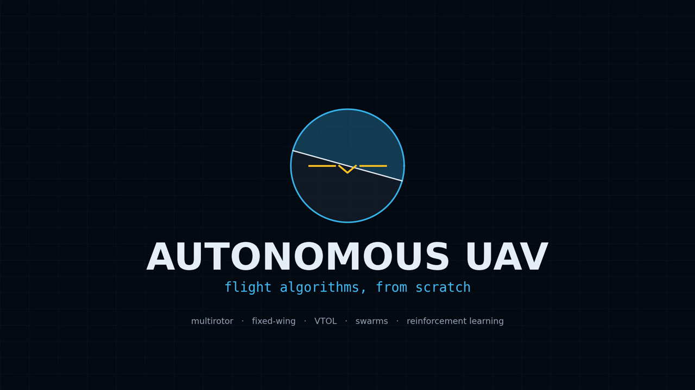

<div align="center">

# Autonomous UAV

**Flight algorithms, from scratch.**

Multirotor, fixed-wing and VTOL flight models with the physics written out
in full — plus 42 runnable simulations and a gym for teaching a drone to
fly itself.

[**Documentation**](https://guilyx.github.io/autonomous-uav-guide/) ·
[Getting started](https://guilyx.github.io/autonomous-uav-guide/guide/getting-started) ·
[Flight models](https://guilyx.github.io/autonomous-uav-guide/vehicles/) ·
[Reinforcement learning](https://guilyx.github.io/autonomous-uav-guide/learning/) ·
[Algorithm atlas](https://guilyx.github.io/autonomous-uav-guide/simulations/)

[](https://github.com/guilyx/autonomous-uav-guide/actions/workflows/ci.yml)
[](https://guilyx.github.io/autonomous-uav-guide/)
[](https://www.python.org/downloads/)
[](LICENSE)
[](https://github.com/astral-sh/ruff)
[](https://pre-commit.com/)
[](https://github.com/astral-sh/uv)

</div>

<a href="https://guilyx.github.io/autonomous-uav-guide/#see-it-fly">
  
</a>

<sub>Seventy-eight seconds of quadrotor, fixed-wing, VTOL, planning, trajectory generation, estimation, mapping, swarms and reinforcement learning, closing on all 42 simulations — <a href="https://guilyx.github.io/autonomous-uav-guide/#see-it-fly">watch it</a>. Every frame is simulated at render time by <a href="scripts/make_promo.py"><code>scripts/make_promo.py</code></a>.</sub>

---

## Install

```bash
pip install uav-sim
```

```bash
uav-sim doctor            # verify the install, run the physics self-checks
uav-sim list              # browse 42 simulations
uav-sim run pid_hover     # render one to a GIF
uav-sim train hover       # teach a quadrotor to hold position
```

## Sixty seconds in

A fixed wing, trimmed and flown to a new altitude and heading:

```python
from uav_sim.vehicles.fixed_wing import create_fixed_wing, FixedWingPreset
from uav_sim.control.fixed_wing_autopilot import FixedWingAutopilot, AutopilotCommand

aircraft = create_fixed_wing(FixedWingPreset.SKYWALKER_X8)
aircraft.reset_trimmed(altitude=120.0)          # solve for equilibrium flight

pilot = FixedWingAutopilot(aircraft.fw_params)  # gains derived from the airframe
command = AutopilotCommand(altitude=160.0, airspeed=20.0, course=1.0)

for _ in range(12_000):
    aircraft.step(pilot.compute(aircraft.state, command, 0.01), 0.01)

print(aircraft.state[2])    # 160.0
```

## What is here

| | |
|---|---|
| **Vehicles** | 6DOF quadrotor with motor dynamics · full Beard & McLain fixed-wing · tilt-rotor VTOL that transitions |
| **Control** | Cascaded PID · LQR · MPC · pure pursuit · geometric SO(3) · fixed-wing autopilot · VTOL mode scheduler |
| **Planning** | A* · RRT* · PRM · potential field · coverage · min-snap · Frenet · quintic |
| **Estimation** | EKF · UKF · particle filter · complementary filter · EKF-SLAM |
| **Perception** | Occupancy mapping · obstacle detection · visual servoing · gimbal tracking |
| **Swarm** | Reynolds flocking · consensus · virtual structure · leader-follower · Voronoi coverage |
| **Learning** | 6 RL environments · pure-NumPy trainer (ARS, CEM) · optional Gymnasium integration |

Nothing here wraps a solver. The Newton-Euler equations, the aerodynamic
coefficient build-up, the Kalman recursions and the sampling-based planners
are written out in NumPy next to the citation they came from.

## Flight models

Three airframes, one frame convention, so they compose.

```python
from uav_sim.vehicles.fixed_wing import create_fixed_wing, FixedWingPreset

aircraft = create_fixed_wing(FixedWingPreset.AEROSONDE)
controls = aircraft.reset_trimmed(airspeed=35.0, altitude=200.0)

for _ in range(6000):
    aircraft.step(controls, 0.005)

aircraft.state[2]     # 200.0 — thirty seconds, open loop, no drift
```

That is the acceptance test for the whole aerodynamic model: if any force
or moment is inconsistent, trim is not an equilibrium and the aircraft
wanders. Every stability derivative is live, and there is a test that fails
if you zero any of them.

- [Fixed-wing](https://guilyx.github.io/autonomous-uav-guide/vehicles/fixed-wing) — coefficient build-up, stall, trim solver
- [VTOL tilt-rotor](https://guilyx.github.io/autonomous-uav-guide/vehicles/vtol) — hover → cruise → hover with altitude held
- [Quadrotor](https://guilyx.github.io/autonomous-uav-guide/vehicles/quadrotor) — mixer and per-motor dynamics

## Teach one to fly

```bash
uav-sim envs                # 6 tasks: hover, waypoint, trajectory, landing, 2 fixed-wing
uav-sim train hover         # pure NumPy — no deep-learning stack
uav-sim play hover --policy policies/hover.npz --gif hover.gif
```

```python
from uav_sim.gym import make, train, evaluate

result = train("hover", iterations=120, seed=0)
print(evaluate("hover", result.policy, episodes=25))
```

Gymnasium's API without the Gymnasium dependency. Install
`uav-sim[gym]` and the environments register as `uav_sim/Hover-v0` for use
with any standard RL library.

The interesting part is not the algorithm — it is that
[four setup choices](https://guilyx.github.io/autonomous-uav-guide/learning/design-notes)
decide whether these tasks are learnable at all. Each is documented with
the measurement that motivated it.

## Simulations

Forty-odd runnable demos, each with a three-panel animation, an academic
reference and a JSON log:

```bash
uav-sim list
uav-sim info astar_3d
uav-sim run astar_3d
```

Browse them all in the
[algorithm atlas](https://guilyx.github.io/autonomous-uav-guide/simulations/).

## Conventions

Worth ten minutes before you write a controller:

| | Frame | Axes |
|---|---|---|
| World | **ENU** | `x` east, `y` north, `z` up |
| Body | **FLU** | `x` forward, `y` left, `z` up |

A consequence of Forward-Left-Up is that **positive pitch is nose-down**,
and because the world is ENU, **banking right decreases the heading**.
Aerodynamics texts use Forward-Right-Down; the library converts at the
boundary rather than rewriting the equations. Full details in
[Frames and conventions](https://guilyx.github.io/autonomous-uav-guide/guide/conventions).

## Development

```bash
git clone https://github.com/guilyx/autonomous-uav-guide.git
cd autonomous-uav-guide
uv sync --all-groups

uv run uav-sim doctor
uv run pytest

pre-commit install && pre-commit install --hook-type commit-msg
```

Contributions welcome — see [CONTRIBUTING.md](CONTRIBUTING.md) for the bar
a new algorithm has to clear, and
[CHANGELOG.md](CHANGELOG.md) for what has changed.

## Safety

These models are simplified, the controllers are not certified, and nothing
here has been validated against a real airframe. Do not fly hardware on
control code taken from this repository without independent verification.
See [SECURITY.md](SECURITY.md).

## License

MIT — see [LICENSE](LICENSE).
